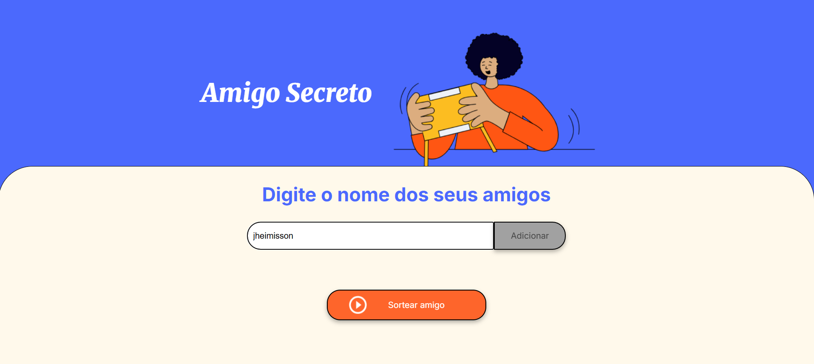
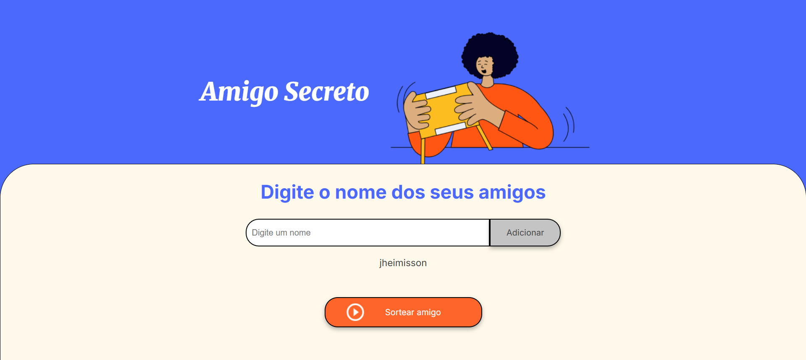
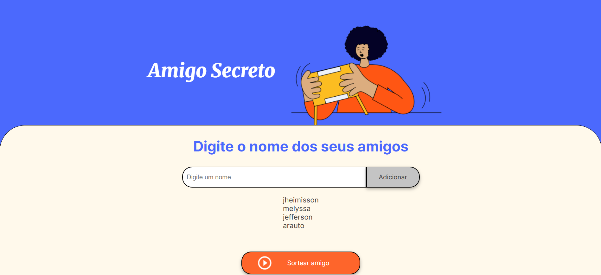
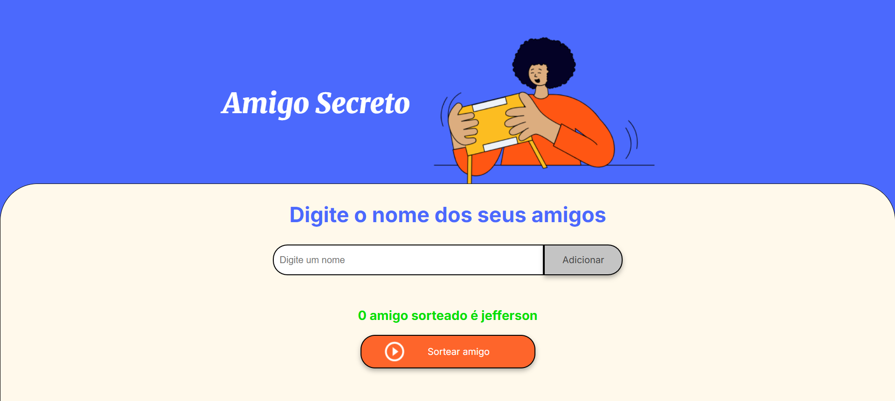

# Sorteador de Amigo Secreto

Este é um projeto simples para sortear amigos em um evento de "Amigo Secreto". O usuário pode digitar nomes em um campo de texto, adicioná-los a uma lista e, em seguida, sortear um amigo dessa lista.

## Funcionalidades

* **Adicionar Nomes**: Permite ao usuário digitar nomes e adicioná-los à lista de participantes do sorteio.
* **Listagem de Participantes (implícito)**: Embora não explicitamente visível na imagem, presume-se que os nomes adicionados serão exibidos em algum lugar.
* **Sorteio Aleatório**: Ao clicar no botão "Sortear amigo", um nome da lista será escolhido aleatoriamente e exibido.

## Como Usar

1.  **Digite um nome**: No campo de texto com o placeholder "Digite um nome", insira o nome de um participante.
2.  
3.  **Adicionar**: Clique no botão "Adicionar" para incluir o nome na lista de participantes.
4.  
5.  **Repita**: Adicione quantos nomes forem necessários para o seu Amigo Secreto.
6.  
7.  **Sortear Amigo**: Após adicionar todos os participantes, clique no botão "Sortear amigo".
8.  
9.  **Resultado**: O nome do amigo sorteado será exibido abaixo do campo de entrada (por exemplo, "O amigo sorteado é Jefferson").

## Tecnologias 

Com base na interface, este projeto provavelmente utiliza tecnologias web padrão:

* **HTML**: Para a estrutura da página.
* **CSS**: Para a estilização e layout (como as cores, formas arredondadas, etc.).
* **JavaScript**: Para a lógica de adicionar nomes, gerenciar a lista e realizar o sorteio.
